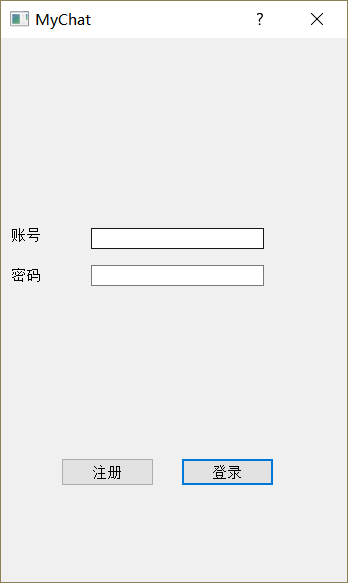
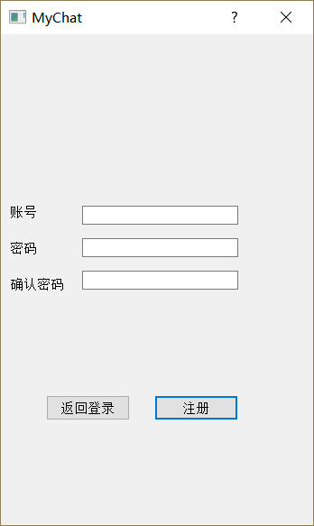
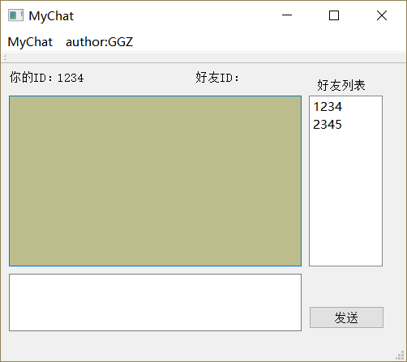

# MyChat

Author：GGZ

### 所依赖的外部库

- **JsonCpp**

- **mysql++**

### 代码结构

##### 服务端

- server.cpp 主函数

- api_db.cpp 对数据库操作库mysql++的封装，封装对数据库的读写操作

- api_json.cpp 对json库操作库jsoncpp的封装，封装json与string的转换

##### 客户端

- 注册页面
- 登录页面
- 聊天页面

### 运行效果

### 

